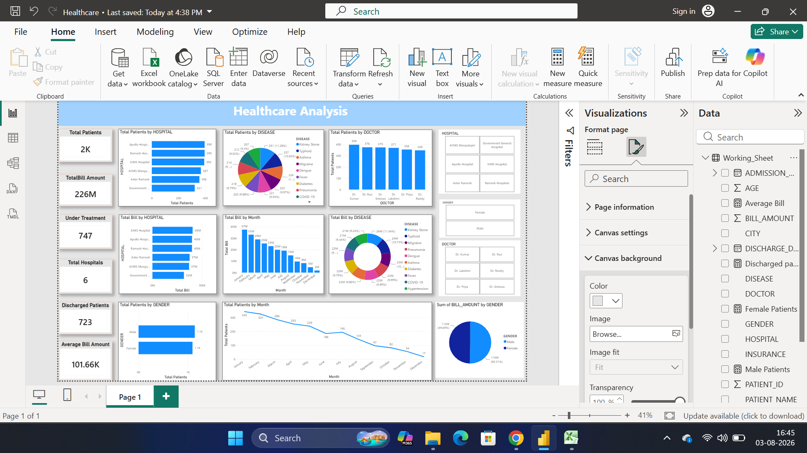

# healthcare-analytics-dashboard
Power BI dashboard for healthcare analytics using real-world dataset
# 🏥 Healthcare Analytics Dashboard

## 📌 Project Overview
This project is a Power BI dashboard built to analyze healthcare data including patient details, billing, hospitals, and disease trends.

## 📂 Dataset
- Raw dataset: original unprocessed data
- Cleaned dataset: processed data used for dashboard

## 🛠️ Tools Used
- Power BI
- DAX
- Excel

## 📊 Features
- Patient count and billing analysis
- Disease-wise distribution
- Gender-based insights
- Monthly trends
- Hospital performance analysis

## 📸 Dashboard Preview

## 🔄 Data Cleaning Steps
- Removed null values
- Standardized formats
- Created calculated columns using DAX

## 🚀 Key Insights
- Identified most common diseases
- Analyzed revenue trends
- Found peak patient months

## 📁 Files Included
- Power BI dashboard (.pbix)
- Raw dataset
- Cleaned dataset
- Dashboard screenshot
